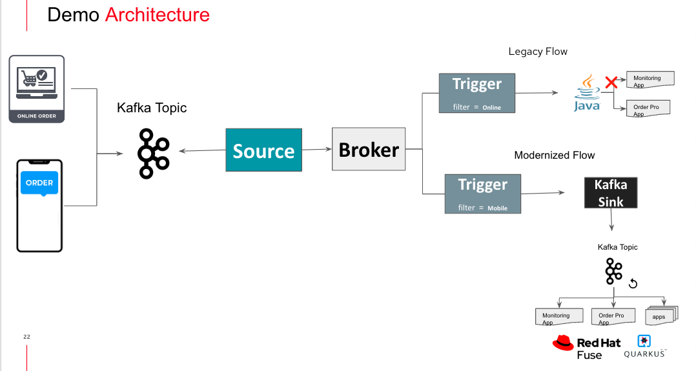

# Knative-Kafka-Broker



The Knative Broker implementation for Apache Kafka is a Kafka-native implementation of the Knative Broker application programming interfaces (APIs). This implementation offers improvements over the channel-based Knative Broker implementation, like reduced network hops, support for any Kafka version, and better integration with Apache Kafka for the Broker and Trigger model.

## Pre-requisites 
- Install AMQ Streams operator and create an instance of Kafka in a project ‘knkafkabroker’
- Install OpenShift Serverless operator and create instances of Knative Serving, Knative Eventing and Knative Kafka in their respective projects.
- Create knative serving instance using default info.
- Create Knatve eventing using default info
- Create Knative Kafka instance selecting source enabled, broker enabled and sink enabled option in OCP WebConsole form UI. 
- Create kafka topics ‘src-topic’ and ‘sink-topic’


### Create Knative Service 

`kn service create legacy-app --image <any-legacy-app-image>`


### Create Kafka Knative Broker in project knkafkabroker
```
apiVersion: eventing.knative.dev/v1
kind: Broker
metadata:
  annotations:
    eventing.knative.dev/broker.class: Kafka
  name: kafka-broker
spec:
  config:
    apiVersion: v1
    kind: ConfigMap
    name: kafka-broker-config
    namespace: knative-eventing
```    
    


### Create KafkaSource using Kafka Knative Broker
```  
apiVersion: sources.knative.dev/v1beta1
kind: KafkaSource
metadata:
  name: kafka-source
  namespace: user1
spec:
  bootstrapServers:
    - 'my-cluster-kafka-bootstrap.knkafkabroker.svc:9092'
  consumerGroup: cg
  consumers: 1
  initialOffset: latest
  net:
    sasl:
      password: {}
      type: {}
      user: {}
    tls:
      caCert: {}
      cert: {}
      key: {}
  sink:
    ref:
      apiVersion: eventing.knative.dev/v1
      kind: Broker
      name: kafka-broker
      namespace: knkafkabroker
  topics:
    - src-topic
```


### Create KafkaSink referred by Trigger to deliver message
```
apiVersion: eventing.knative.dev/v1alpha1
kind: KafkaSink
metadata:
  name: kafka-sink
spec:
  bootstrapServers:
    - 'my-cluster-kafka-bootstrap.knkafkabroker.svc:9092'
  topic: sink-topic
```


### Create Online and Mobile Order Trigger
```
apiVersion: eventing.knative.dev/v1
kind: Trigger
metadata:
  name: web-order-trigger
spec:
  broker: kafka-broker
  filter:
    attributes:
      kafkaheadercetype: online 
  subscriber:
    ref:
     apiVersion: serving.knative.dev/v1
     kind: Service
     name: legacy-app
    uri: /web-order

---
apiVersion: eventing.knative.dev/v1
kind: Trigger
metadata:
  name: mobile-order-trigger
spec:
  broker: kafka-broker
  filter:
    attributes:
      kafkaheadercetype: mobile
  subscriber:
    ref:
     apiVersion: eventing.knative.dev/v1alpha1
     kind: KafkaSink
     name: kafka-sink    
```

### Connect to kafka broker pod to mimic online order app and mobile order app

open shell prompt in kafka pod <br>
  `oc rsh my-cluster-kafka-0` <br>

**Producer**<br>
 
`bin/kafka-console-producer.sh --broker-list my-cluster-kafka-bootstrap:9092 --topic src-topic  --property parse.key=true --property parse.headers=true`<br>

Ce-Type:online        iphone	13-128GB
Ce-Type:mobile       iphone     14-256GB

**Consumer showing kafka sink**<br>

`bin/kafka-console-consumer.sh --bootstrap-server my-cluster-kafka-bootstrap:9092 --topic sink-topic --from-beginning` <br>

You can similar promts to check if message is received at Broker src-topic.


